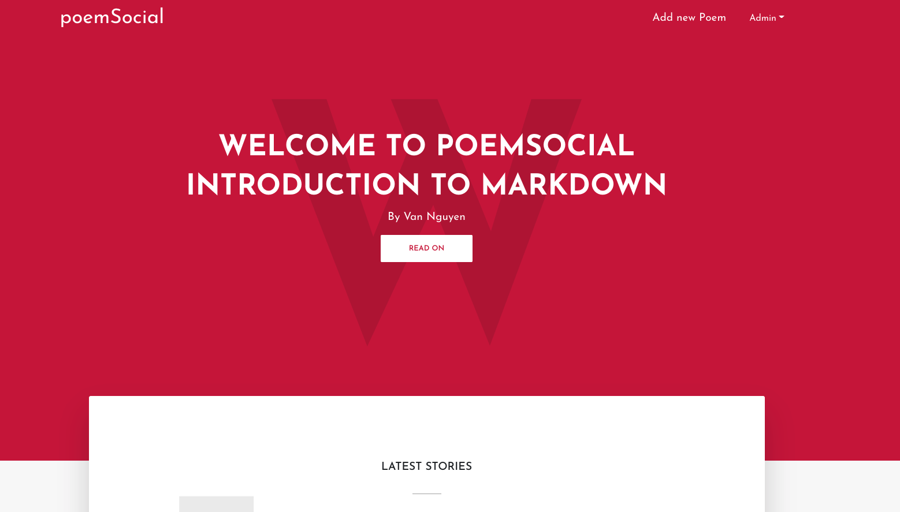
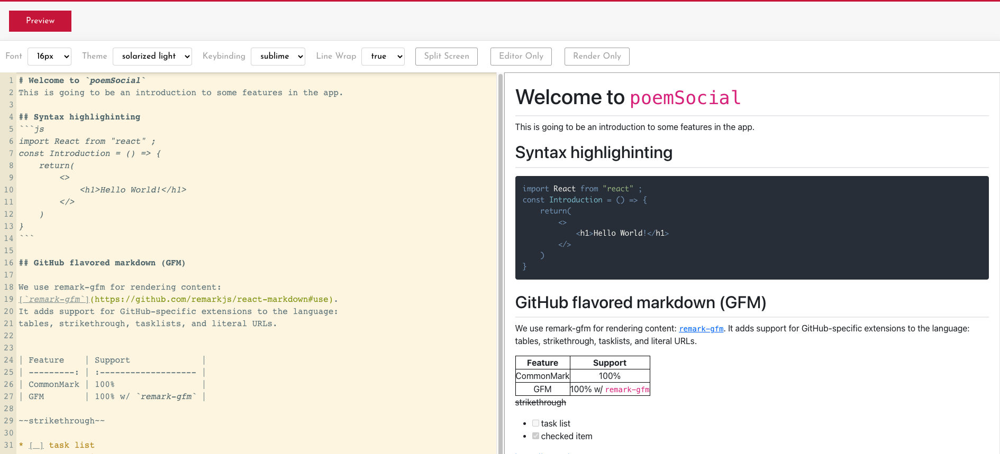

# PoemSocial Platform

Preview the page: [Link](https://poemsocialapp42.herokuapp.com/)



**Having Markdown editor**


## Current Features

- Upvote and DownVote for each poem
- Markdown Editor with customized functions(theme, fontsize, keybinding,...)

## Usage

### Es Modules in Node

This app is using ECMAScript Modules in the backend. Besure to have at least Node v15.0+ or you will need to add the "--experimental-modules" flag.

Also, when importing a file(not a package), be sure to add **.js** at the end or you will get a "module not found" error.

### Env Variables

Create a .env file in the root and add the following

```
NODE_ENV = development
PORT = 5000

# you can set whatever value for JWT_SECRET (here I set "abc123")
JWT_SECRET = "abc123"
```

### Install Dependencies (frontend & backend)

```
npm install
cd frontend
npm install
```

### Run

```
# Run frontend (:3000) & backend (:5000)
npm run dev

# Run backend only
npm run server
```

### Build & Deploy

```
cd frontend
npm run build
```

There is a Heroku postbuild script, so if you push to Heroku, no need to build manually for deployment to Heroku.

### Sample authentication data

```
ahihi@test.com (Admin)
123456

ahihi@test.com (User)
123456

ahihi@test.com (User)
123456
```

## License

MIT License

Copyright (c) 2021 Van Nguyen Nguyen

Permission is hereby granted, free of charge, to any person obtaining a copy
of this software and associated documentation files (the "Software"), to deal
in the Software without restriction, including without limitation the rights
to use, copy, modify, merge, publish, distribute, sublicense, and/or sell
copies of the Software, and to permit persons to whom the Software is
furnished to do so, subject to the following conditions:

The above copyright notice and this permission notice shall be included in all
copies or substantial portions of the Software.

THE SOFTWARE IS PROVIDED "AS IS", WITHOUT WARRANTY OF ANY KIND, EXPRESS OR
IMPLIED, INCLUDING BUT NOT LIMITED TO THE WARRANTIES OF MERCHANTABILITY,
FITNESS FOR A PARTICULAR PURPOSE AND NONINFRINGEMENT. IN NO EVENT SHALL THE
AUTHORS OR COPYRIGHT HOLDERS BE LIABLE FOR ANY CLAIM, DAMAGES OR OTHER
LIABILITY, WHETHER IN AN ACTION OF CONTRACT, TORT OR OTHERWISE, ARISING FROM,
OUT OF OR IN CONNECTION WITH THE SOFTWARE OR THE USE OR OTHER DEALINGS IN THE
SOFTWARE.
